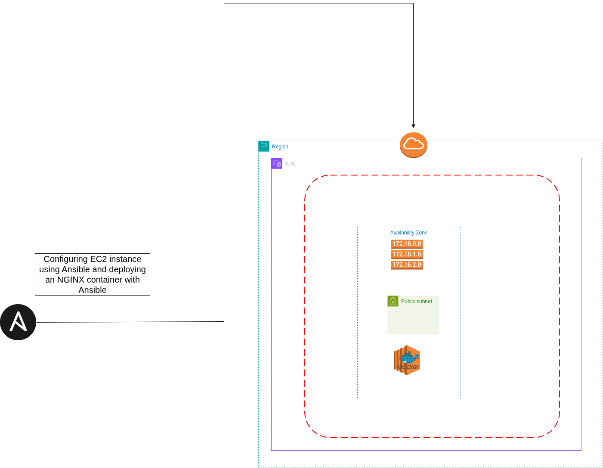

# Terraform-Ansible-Stack
A Terraform and Ansible stack where the aws infrastructure is build using Terraform and Ansible is used for configure the infrastructure.
This is a simple project where the AWS infrastructure is build with Terraform and is configured with Ansible Automation tool to deploy a Dockerized NGINX webserver.

## 🏗️ Architecture
- **VPC** with public subnet.
- **EC2 Instance** running Docker.
- **Security Group** for traffic control.
- **S3 backend** for Terraform state management.
- ** NGINX Container** serving custom static HTML,CSS,JavaScript content.

## 🛠️ Technologies Used
- Terraform (For creating Infrastructure)
- Ansible ( For configuring the infrastructure)
- AWS (VPC,EC2,S3,Security Groups)

## 📝 Prerequisites
- AWS Account
- AWS CLI configured
- Terraform installed
- Ansible Installed
- SSH key pair for accessing EC2 instance

## 🚀 Setup & Deployment
### 1. ⿻ Clone the repository
``` bash
git clone
```

### 2. 🚨 Configure changes in the terraform files and ansible files. Make sure you set your ip address,ssh key-pair location in the terraform files. Please see the provider.tf, terraform.tfvars for making changes so you wont face nay problem. Also add your ec2 instance ip address in the Ansible hosts.ini file for successfull ssh conenction between Ansible and EC2 instance.

### 3. ⚙️ Configure Terraform
``` bash
cd terraform-stack
terraform fmt
terraform init
terraform validate
terraform plan
terraform apply
```

### 4. 🚀 Run Ansible Playbook
``` bash
cd ansible-stack
ansible-playbook -i hosts.ini aws-ec2-configure.yml
```

### 5. 🌐 Access the application
Navigate to `http://<ec2-public-ip-address>` in your browser

### 📁 Project Structure
```
Terraform-Ansible-Stack/
├── terraform/
│   ├── compute.tf
│   ├── networking.tf
│   └── provider.tf
|   └── security.tf
|   └── terraform.tfvars
|   └── variables.tf
├── ansible/
│   ├── aws-ec2-configure.yml
│   └── hosts.ini
|   └── wesbite/
            └── index.html
└── README.md
```

## ✅ What i learned
- Infrastructure As Code with Terraform
- Configuration Management with Ansible
- AWS Networking and Security
- Docker Containerization
- Remote State Management with S3

## 🔮 Future Improvements
- Add multiple EC2 instances
- Develop this into a 3 tier architecture app
- Implement auto scaling
- Add monitoring and logging using Prometheus
- Set up CI/CD Pipeline for complete automation

## Architecture Diagram 👉 
### If having problem to understand the diagram then run the Infra-with-Ansible/terraform-ansible-docker-stack/AWS-Terraform-Ansible-Architecture-Diagram/diagram.html code in your favourite code editor.
## License
MIT

## Author
Aman Dabral - 

