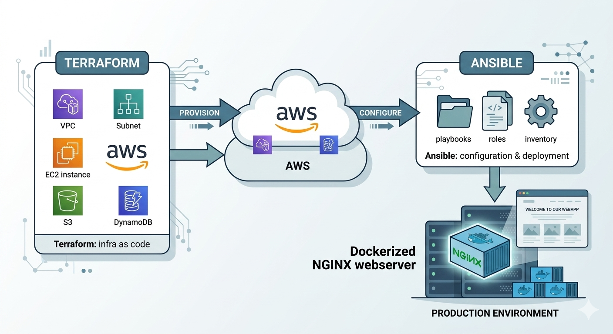

# Terraform-Ansible-Stack
A Terraform + Ansible stack that provisions and configures AWS infrastructure: Terraform defines and creates the AWS resources (VPC, subnets, EC2, S3, DynamoDB, etc.), and Ansible automates configuration and deployment on the provisioned instances. This simple project uses Terraform to build the infrastructure and Ansible Automation to deploy a Dockerized NGINX web server on the servers.


## 🏗️ Architecture
- **VPC** with public subnet.
- **EC2 Instance** running Docker.
- **Security Group** for traffic control.
- **S3 backend** for Terraform state management.
- **NGINX Container** serving custom static HTML,CSS,JavaScript content.

## 🛠️ Technologies Used
- Terraform (For creating Infrastructure)
- Ansible ( For configuring the infrastructure)
- AWS (VPC,EC2,S3,Security Groups)

## 📝 Prerequisites
- AWS Account
- AWS CLI configured
- Terraform installed
- Ansible Installed
- SSH key pair for accessing EC2 instance

## 🚀 Setup & Deployment
### 1. ⿻ Clone the repository
``` bash
git clone https://github.com/amandev-x/Terraform-Ansible-Stack.git
```

### 2. 🚨 Configure changes in the terraform files and ansible files. Make sure you set your ip address,ssh key-pair location in the terraform files. Please see the provider.tf, terraform.tfvars for making changes so you wont face any problem. Also add your ec2 instance ip address in the Ansible hosts.ini file for successfull ssh conenction between Ansible and EC2 instance.

### 3. ⚙️ Configure Terraform
``` bash
cd terraform-stack
terraform fmt
terraform init
terraform validate
terraform plan
terraform apply
```

### 4. 🚀 Run Ansible Playbook
``` bash
cd ansible-stack
ansible-playbook -i hosts.ini aws-ec2-configure.yml
```

### 5. 🌐 Access the application
Navigate to `http://<ec2-public-ip-address>` in your browser

### 📁 Project Structure
```
Terraform-Ansible-Stack/
├── terraform/
│   ├── compute.tf
│   ├── networking.tf
│   └── provider.tf
|   └── security.tf
|   └── terraform.tfvars
|   └── variables.tf
├── ansible/
│   ├── aws-ec2-configure.yml
│   └── hosts.ini
|   └── wesbite/
            └── index.html
└── README.md
```

## ✅ What i learned
- Infrastructure as Code with Terraform
- Configuration management with Ansible
- AWS networking and security (VPCs, subnets, security groups)
- Docker containerization (building and running Dockerized services)
- Remote state management with S3 and state locking (DynamoDB)

## 🔮 Future Improvements
- Add multiple EC2 instances for redundancy and load distribution

- Evolve into a 3-tier application architecture (web, app, database)

- Implement autoscaling for demand-based capacity
- Add monitoring and logging with Prometheus and a log aggregator (e.g., Loki/ELK)
- Build a CI/CD pipeline to automate provisioning, configuration, and deployment

## Architecture Diagram 

## License
MIT

## Author
Aman Dabral

